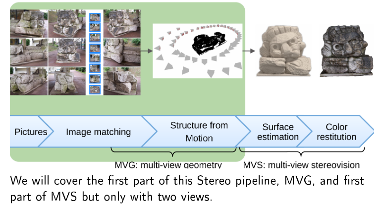

# 3D Computer Vision

*Source: course slides (Pascal Monasse)*

This course had 4 assignments:

* [Panorama](ex1-panorama)

* [Fundamental matrix estimation](ex2-fundamental-matrix)

* [Disparity map estimation with local methods (using seeds)](ex3-seeds)

* [Disparity map estimation with graph cuts](ex4-gc-disparity)

All the code is in C++ and can be compiled using the `CMakeLists.txt` on each directory.