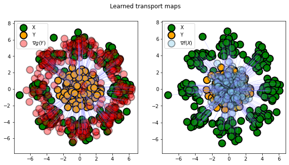

# Computational Optimal Transport

## Numerical Tours

The course had 4 numerical tours. These consisted in Jupyter Notebooks we had to run with our own data, and briefly comment on the results. Some of them required some implementations too.

* [Linear Programming](numerical-tours/optimaltransp_1_linprog.ipynb)

* [Entropic Regularization](numerical-tours/optimaltransp_5_entropic.ipynb)

* [Advanced Topics on Sinkhorn Algorithm](numerical-tours/optimaltransp_6_entropic_adv.ipynb)

* [Semidiscrete Optimal Transport](numerical-tours/optimaltransp_7_semidiscrete.ipynb)

---

## Project
### Optimal transport mapping via input convex neural networks

The course evaluation was done over a project, which consisted in reading a scientific article and performing numerical experiments with the proposed method.

I worked on [Optimal transport mapping via input convex neural networks](https://arxiv.org/abs/1908.10962):

* Implementation of the proposed algorithm from scratch
* Experimental tests across different datasets and comparison with traditional methods